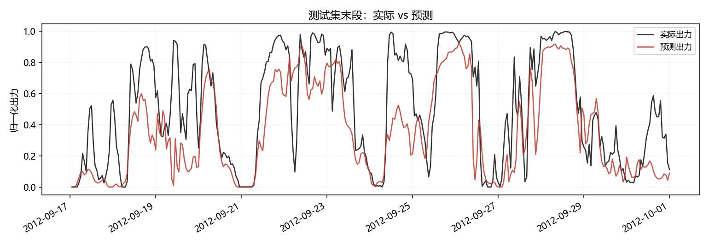

# 风电功率预测 · Wind Power Forecasting

用数值天气预报（NWP）的风场预报预测风电场出力，基于 **GEFCom2014** 国际预测竞赛标准数据集。

**核心思路**：先用大气边界层物理把 NWP 的 U/V 分量还原成风速与风切变，建立**符合风机物理特性的功率曲线基线**，再上机器学习做对比。

---

## 📊 主要结果

按时间序列切分（前 70% 训练，后 30% 测试），10 个风电场，65760 条样本。


> 上图：观测散点与经验功率曲线。可以清楚看到**低风速段的切入**、
> **中间的三次方爬坡段**、以及**高风速段的饱和** —— 这就是为什么不能用线性回归。

### 实验 A【纯 NWP 预报】不含任何历史实测

| 模型 | RMSE | MAE | 准确率 % | 合格率 % |
|---|---|---|---|---|
| **物理基线·功率曲线** | **0.1949** | **0.1399** | **80.51** | **82.56** |
| LightGBM | 0.1991 | 0.1482 | 80.09 | 80.71 |
| Ridge 回归 | 0.1998 | 0.1533 | 80.02 | 81.04 |
| 对照组·风速线性回归 | 0.2010 | 0.1521 | 79.90 | 80.22 |
| 物理基线·纯立方律 | 0.2387 | 0.1659 | 76.13 | 74.58 |

> 准确率 = (1 − RMSE/装机容量) × 100%，国标口径


### 实验 B【NWP + 近期实测】超前一小时滚动预测

| 模型 | RMSE | 准确率 % | 合格率 % |
|---|---|---|---|
| Ridge 回归 | 0.0938 | 90.62 | 97.40 |
| LightGBM | 0.0942 | 90.58 | 97.38 |
| 基线·持续性 | 0.1003 | 89.97 | 96.45 |



> 上图：测试集末段的实际出力与预测出力对比

---

## 🔍 两个值得说的发现

### 发现 1：纯 NWP 场景下，物理基线打败了机器学习

只给 NWP 风场预报时，**手工构造的功率曲线基线（80.51%）反而比 LightGBM（80.09%）更好**。

**这不是模型不行，而是信息量的天花板**：输入只有 4 个变量（U10/V10/U100/V100），
而功率曲线恰好是这 4 个变量到出力的**物理最优映射**。树模型在这点数据上
无法再榨出额外信息，反而因为样本噪声产生轻微过拟合。

**结论**：在特征信息有限时，**正确的物理先验比模型复杂度更值钱**。

### 发现 2：为什么必须拆成两个实验

第一版把「上一时刻实测出力」也当特征喂给 ML，结果**持续性基线（最笨的算法）打败了所有物理基线**。

原因不是物理基线差，而是**比较不公平**：
- 持续性 / ML 手里有历史实测
- 物理基线只能拿到 NWP 预报

这是两个不同的任务（提前几小时预测 vs 超前 1 小时滚动预测），混在一起比没有意义。
拆开之后，各自的对手才是有意义的：实验 A 里物理基线是标杆，实验 B 里持续性基线是门槛。

---

## 🧠 物理特征（本项目与纯 CS 方案的区别）

| 特征 | 公式 | 为什么需要 |
|---|---|---|
| 风速 | `ws = √(U² + V²)` | **矢量合成**，U/V 是分量不是风速 |
| 风向 | `wd = atan2(−U, −V)` | 气象约定，风从哪来 |
| **风切变指数** | `α = ln(ws100/ws10) / ln(100/10)` | 大气边界层幂律，反映**稳定度**：白天 α 小、夜间 α 大 |
| 功率曲线 | 分箱取中位数 | 出力 ∝ v³，且有切入/额定/切出分段 |

### 特征重要性验证（实验 A，纯 NWP）


```
doy_sin   4600   年周期（季节变化）
shear     4090   ← 风切变，排第 2
doy_cos   3429
ws100     3365   ← 正确合成的风速
u100      2853   ← 原始分量，排在后面
u10       2812
v10       2800
```

**两个结论**：

1. **风切变进了前二** —— 这个特征确实携带了模型需要的信息
   （大气边界层的稳定度变化），而不是冗余变量。
2. **`ws100` 排在 `u100` / `v100` 前面** —— 证明「U/V 必须先合成风速」
   这一步不是多余的：模型自己虽然也能学，但显式构造物理量更有效。

> 风切变是最有价值的特征：风机轮毂在 100 m，而边界层廓线随稳定度变化，
> 纯 CS 背景不会想到加这个量。

---

## 📁 项目结构

```
.
├── run.py                    # 一键复现（两个实验）
├── 说明书.md                  # 详细原理讲解（给自己看）
├── requirements.txt
├── data/
│   ├── download.py           # 数据下载（多镜像兜底）
│   └── raw/                  # 10 个风场，6.5 MB
├── src/
│   ├── loader.py             # 读数据、解时间戳
│   ├── features.py           # ★ 物理量还原 + 特征工程
│   ├── baselines.py          # ★ 物理基线（功率曲线/立方律/线性）
│   ├── models.py             # 持续性、Ridge、LightGBM
│   ├── evaluate.py           # 国标口径指标 + 分档误差
│   └── plots.py              # 出图
└── results/                  # 对比表 + 图
```

---

## 🚀 复现

```bash
pip install -r requirements.txt

python data/download.py      # 下载数据（约 6.5 MB）
python run.py                # 跑全部实验
```

可选参数：
```bash
python run.py --zones 1 2 3 --test-ratio 0.3
```

---

## ⚠️ 踩过的坑

1. **时间戳格式不规范** —— `20120101 1:00` 小时不补零，
   `pd.to_datetime` 会解析失败或误判时区，必须手工拆。
2. **U/V 是矢量分量，不是风速** —— 直接取 U 或取绝对值都会错，必须 `√(U²+V²)`。
3. **绝对不能随机切分** —— 时间序列自相关会让未来信息泄漏，
   指标虚高到 RMSE≈0.02，但上线就废。
4. **滞后特征必须按风场分组** —— 10 个风场是并排的时间序列，
   不 `groupby(zone)` 的话，风场 1 的末行会跑去给风场 2 的首行当滞后值。
5. **误差是异方差的** —— 爬坡段（6~12 m/s）误差最大，
   因为这一段出力对风速的 v³ 敏感。只报总体 RMSE 会掩盖这个结构。

---

## 📈 后续计划

- [ ] **概率预测**：给出预测区间而非单点（GEFCom2014 Task 15 有官方 Pinball Loss 评分）
- [ ] 扩展到全部 15 个 Task，做滚动预测实验
- [ ] 空间特征：利用 10 个风场之间的空间相关性
- [ ] 尝试 TFT / PatchTST，**前提是能打过 LightGBM**
- [ ] 包一个 FastAPI 服务，做成可调用的接口

---

## 📚 数据来源与许可

### 数据出处

GEFCom2014（**Global Energy Forecasting Competition 2014**），
由 **IEEE Power & Energy Society** 主办的国际能源预测竞赛，
风电赛道（Wind Track）提供 10 个风电场的实测出力与 NWP 预报。

**引用**：

> Hong, T., Pinson, P., Fan, S., Zareipour, H., Troccoli, A., & Hyndman, R. J. (2016).
> Probabilistic energy forecasting: Global Energy Forecasting Competition 2014 and beyond.
> *International Journal of Forecasting*, 32(3), 896–913.
> https://doi.org/10.1016/j.ijforecast.2016.02.001

### 许可与合规说明

| 对象 | 情况 |
|---|---|
| **本仓库的源代码** | MIT License（见 `LICENSE`） |
| **GEFCom2014 数据集** | **不在本仓库内**，知识产权归原始竞赛主办方 |

**本仓库不重新分发数据集。** `data/raw/` 已在 `.gitignore` 中排除，
数据由 `data/download.py` 在运行时下载。

### 数据获取

`data/download.py` 默认按以下顺序尝试：

1. 官方分布渠道（Kaggle 上的 GEFCom2014 镜像）
2. 社区 GitHub 镜像（**注意：这些镜像仓库多数没有声明开源协议**，
   本项目仅将其作为一种获取途径，不对其内容主张任何权利）
3. 本地手动放置（从任意合规渠道获得后放入 `data/raw/`）

> ⚠️ **如果你要发布这个项目**：请不要把 `data/raw/` 提交到仓库。
> 数据集的权利不属于你，重新分发可能越界。

## 许可

- **代码**：[MIT](LICENSE) © 2026 [Ricardo-wang-0604](https://github.com/Ricardo-wang-0604)
- **数据**：版权归原始竞赛主办方（IEEE PES / GEFCom2014），本仓库不重新分发

---

## 作者

**Ricardo-wang-0604** · 南京信息工程大学 · 大气物理

> 本项目为个人学习与求职作品。如果你发现问题或有建议，欢迎提 Issue。
