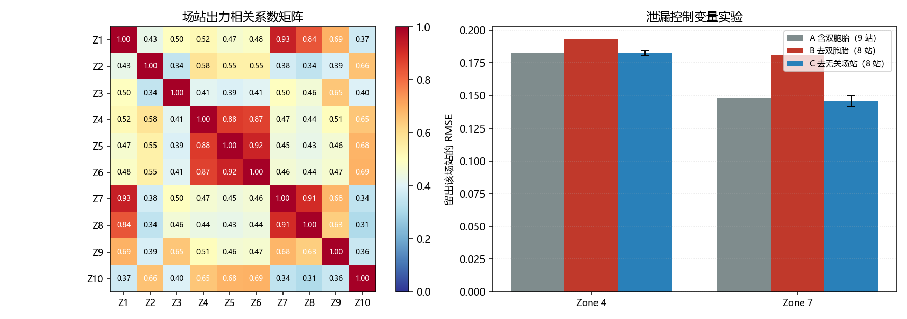
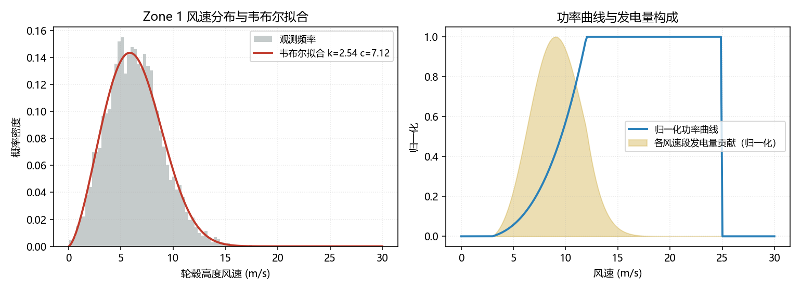
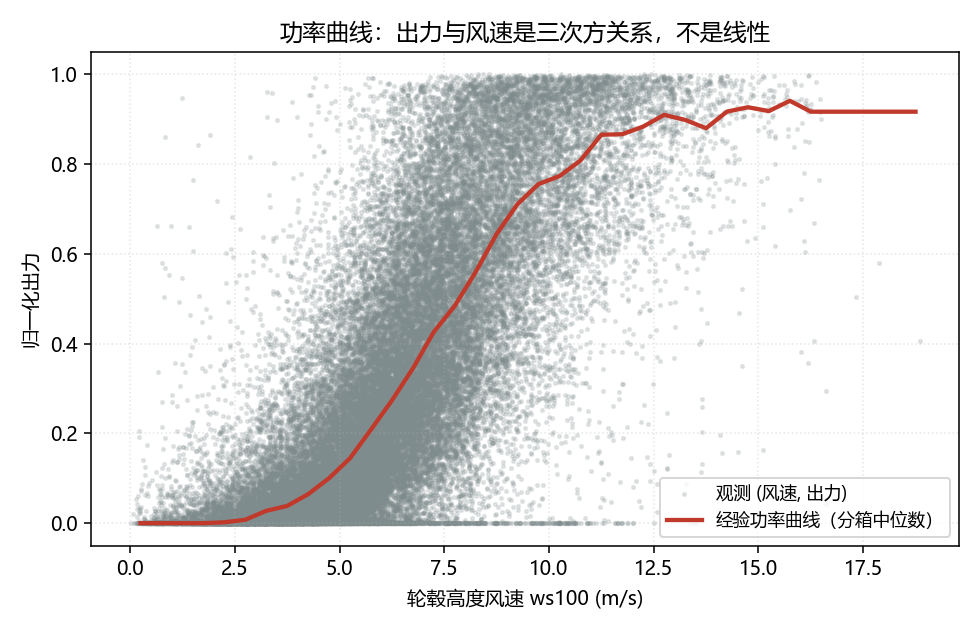
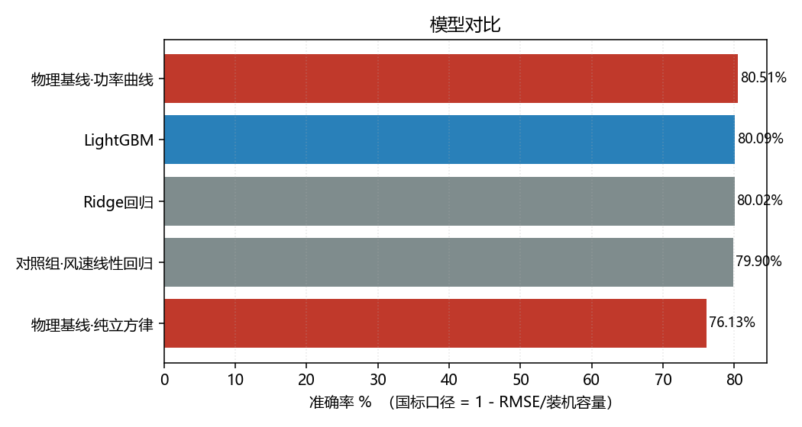
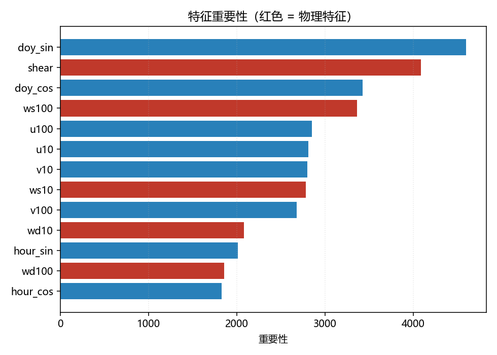

# 风电功率预测、风资源评估与数据质量检验

> 本项目第三部分（多场站数据独立性检验与交叉验证泄漏）已整理为技术文章：
> [《多场站实验中的输入侧重复及其交叉验证泄漏效应》](https://blog.csdn.net/Ricardo13/article/details/165757716)

用 GEFCom2014 数据（IEEE PES 主办国际预测竞赛，10 个风电场，65760 条小时样本）
做三件事：

1. **风资源评估**：韦布尔分布、风功率密度分级、发电量 AEP 与 P50/P75/P90
2. **功率预测**：物理基线对比机器学习，按国标口径评估
3. **数据质量检验**：多场站独立性检验，量化交叉验证泄漏

三块都用同一套大气边界层物理：把数值预报的 U/V 分量还原成风速与风切变，
再往下计算。

```
pip install -r requirements.txt
python data/download.py              # 下载数据，约 6.5 MB
python run.py                        # 功率预测：基线对比与国标口径评估
python wind_resource_report.py       # 风资源评估：AEP 与 P50/P75/P90
python data_qc_report.py             # 数据质量：独立性检验与泄漏实测
```

---

## 数据质量检验

**这一块源自一个真实的发现**：做风资源评估时发现 Zone 4 与 Zone 5 的统计量
完全相同。逐时刻比对后确认，数据集标称 10 个风场，但 **NWP 预报只有 8 份
独立数据** —— 有两组场站共享同一份预报，只有出力不同。

模块 `src/data_qc.py` 把这个检查做成了可复用的工具，不绑定 GEFCom：
任何「多站点 × 时间」的数据（测风塔、气象站、光伏电站）都能用。

| 能力 | 函数 |
|---|---|
| 逐时刻完全相同的场站分组 | `exact_duplicate_groups` |
| 数值接近的场站对（容差法） | `near_duplicate_pairs` |
| 相关矩阵与高相关簇聚类 | `correlation_matrix` / `correlation_clusters` |
| 有效独立样本量 | `effective_sample_size` |
| 交叉验证泄漏风险评估 | `cv_impact` |
| 单站质量校验 | `check_range` / `check_frozen` / `check_jumps` |

### 检验结果

| 项 | 结果 |
|---|---|
| 名义场站数 | 10 |
| 完全重复组 | **2 组**（Zone 4–5、Zone 7–8） |
| **有效独立场站数** | **8** |
| 名义样本量 | 65,760 |
| **有效样本量** | **52,608** |
| 样本量虚高倍数 | **1.25** |
| 泄漏风险等级 | 中 |
| 建议交叉验证折数 | 8（按组划分，而非按场站） |

### 泄漏影响实测（控制变量设计）

**为什么不直接对比「留一场」与「留一组」**：那样训练集场站数也变了
（9 站 vs 8 站），指标变差可能只是数据变少，分不清是哪一个原因。

所以用控制变量，**训练集场站数完全相同**：

- 条件 A：含双胞胎（9 站）
- 条件 B：去掉双胞胎（8 站）
- 条件 C：去掉一个无关场站（8 站，对多个场站重复取均值）

| 测试场站 | A 含双胞胎 | B 去双胞胎 | C 去无关站（均值 ± 标准差） | **相对高估** |
|---|---|---|---|---|
| Zone 4 | 0.1825 | 0.1929 | 0.1822 ± 0.0021 | **5.5%** |
| Zone 7 | 0.1476 | 0.1806 | 0.1456 ± 0.0041 | **19.4%** |

**「相对高估」的定义**（本文档与代码输出统一使用这个口径）：

```
相对高估 = (B − C) / B × 100%
```

即**以无泄漏的真实表现（B）为基准**，含双胞胎时（≈ A ≈ C）指标好了多少。
B 与 C 的训练集场站数相同（都是 8），所以这个差值不受「数据变少」的影响。

> 另有两个口径供参考（数值略有差别，结论一致）：
> `(B − C) / C` = 5.9% / 24.0%（以对照条件 C 为基准）；
> `(B − A) / B` = 5.4% / 18.3%（直接对比两种交叉验证方式）。
> 三者之所以接近，是因为 A ≈ C（差 0.0003 与 0.0020），说明场站数差异的影响可忽略。

A 与 C 都包含双胞胎（分别 0.1825、0.1822），B 不包含（0.1929）。
**差异完全来自「双胞胎在不在训练集」**：去掉它带来的损失，
远超去掉任意一个无关场站的损失。

统计上也站得住：B 的取值超出 C 重复测量的 5.1 倍与 8.5 倍标准差，不是噪声。

**结论**：按场站划分交叉验证时，共享输入数据的场站会互相泄漏，
使模型性能被高估 5.5% 至 19.4%。做多场站实验必须按**组**划分。



---

---

## 风资源评估

风资源模块（`src/wind_resource.py`）覆盖评估流程的核心计算：

| 函数 | 作用 |
|---|---|
| `weibull_fit_mle` / `weibull_fit_moments` | 两种方法拟合韦布尔分布，可互相验证 |
| `wind_power_density_observed` / `_weibull` | 风功率密度，实测法与解析法 |
| `grade_wind_resource` | 按 GB/T 18710 做资源分级 |
| `extrapolate_shear` | 用风切变幂律把风速外推到轮毂高度 |
| `aep_from_weibull` | 韦布尔分布与功率曲线积分求年发电量 |
| `uncertainty_budget` | 不确定性预算，八个分项平方和开根合成 |
| `p_values` | 由 P50 与综合不确定性推出 P75 / P90 |

在 GEFCom2014 十个场站上的结果（单场装机按 50 MW、轮毂 100 m 计）：

| 风场 | 10m 风速 | 轮毂风速 | 切变 α | 轮毂风功率密度 | 容量因子 | P50 (MWh) | P75 (MWh) | P90 (MWh) |
|---|---|---|---|---|---|---|---|---|
| Zone 1 | 3.63 | 6.33 | 0.250 | 242 | 0.209 | 91,580 | 84,091 | 77,350 |
| Zone 2 | 3.90 | 6.38 | 0.222 | 254 | 0.216 | 94,767 | 87,017 | 80,042 |
| Zone 3 | 3.94 | 6.66 | 0.236 | 274 | 0.237 | 103,742 | 95,258 | 87,622 |
| Zone 4 | 4.21 | 6.73 | 0.210 | 295 | 0.249 | 109,279 | 100,342 | 92,298 |
| Zone 5 | 4.21 | 6.73 | 0.210 | 295 | 0.249 | 109,279 | 100,342 | 92,298 |
| Zone 6 | 4.27 | 6.76 | 0.205 | 305 | 0.255 | 111,742 | 102,604 | 94,378 |
| Zone 7 | 4.13 | 6.94 | 0.233 | 323 | 0.270 | 118,415 | 108,731 | 100,015 |
| Zone 8 | 4.13 | 6.94 | 0.233 | 323 | 0.270 | 118,415 | 108,731 | 100,015 |
| Zone 9 | 3.72 | 6.47 | 0.248 | 261 | 0.224 | 98,240 | 90,206 | 82,975 |
| Zone 10 | 3.82 | 6.18 | 0.211 | 229 | 0.197 | 86,440 | 79,371 | 73,008 |

平均容量因子 0.238，与陆上风电典型值（0.20 至 0.35）相符。
综合不确定性 12.1%，与行业典型量级一致。



> 左：轮毂高度风速分布与韦布尔拟合。右：功率曲线与各风速段的发电量贡献。
> 发电量贡献峰值出现在 8 至 10 m/s，即功率曲线爬坡段，而非平均风速处。

---

## 功率预测

**核心思路**：先用大气边界层物理把 NWP 的 U/V 分量还原成风速与风切变，
建立符合风机物理特性的功率曲线基线，再与机器学习模型对比。

---

## 主要结果

评估按时间序列切分，前 70% 作训练集，后 30% 作测试集。准确率按国标口径计算，
即 `(1 - RMSE/装机容量) × 100%`。



上图是观测散点与经验功率曲线。低风速段的切入、中间的三次方爬坡段、高风速段的
饱和都能清楚看到，这也是线性模型不适用于本问题的原因。

### 实验 A：纯 NWP 预报，不含历史实测

| 模型 | RMSE | MAE | 准确率 % | 合格率 % |
|---|---|---|---|---|
| 物理基线·功率曲线 | 0.1949 | 0.1399 | 80.51 | 82.56 |
| LightGBM | 0.1991 | 0.1482 | 80.09 | 80.71 |
| Ridge 回归 | 0.1998 | 0.1533 | 80.02 | 81.04 |
| 对照组·风速线性回归 | 0.2010 | 0.1521 | 79.90 | 80.22 |
| 物理基线·纯立方律 | 0.2387 | 0.1659 | 76.13 | 74.58 |

### 实验 B：NWP 加近期实测，超前一小时滚动预测

| 模型 | RMSE | 准确率 % | 合格率 % |
|---|---|---|---|
| Ridge 回归 | 0.0938 | 90.62 | 97.40 |
| LightGBM | 0.0942 | 90.58 | 97.38 |
| 基线·持续性 | 0.1003 | 89.97 | 96.45 |



---

## 讨论

**物理基线在纯 NWP 输入下优于机器学习。** 只给 NWP 风场预报时，功率曲线基线的
准确率为 80.51%，LightGBM 为 80.09%，机器学习相对基线低 0.42 个百分点。输入
只有 4 个变量（U10、V10、U100、V100），而功率曲线近似是这 4 个变量到出力的最
优物理映射，树模型在同等信息量下难以进一步提升，反而受样本噪声影响。

这一结果有边界：它说明的是在**特征信息受限**时物理先验的价值，并不意味着机器
学习无用。实验 B 加入近期实测后，模型准确率升至 90.62%，比持续性基线高 0.65
个百分点，此时模型提供了持续性基线无法给出的增量。

**两个实验必须分开，否则结论不成立。** 初版把滞后出力一并作为特征，结果是持续性
基线（用上一时刻实测值直接作为预测）反超全部物理基线。问题不在物理基线，而在于
比较不对等：机器学习和持续性基线持有历史实测信息，物理基线只持有 NWP 预报。
这实际是两个不同任务，短期预报与超短期滚动预报。分开之后，实验 A 中物理基线是
标杆，实验 B 中持续性基线是门槛。

**数据集标称 10 个风场，但 NWP 预报只有 8 份独立数据。** 做风资源评估时发现
Zone 4 与 Zone 5、Zone 7 与 Zone 8 的统计量完全相同，逐时刻核对后确认：这两组
场站**共享同一份 NWP 预报**，只有出力不同（两组出力相关系数分别为 0.88 与 0.91）。
各场站的原始文件哈希互不相同，所以只看文件不会发现。

这不是只值得记一笔的细节，而是一个**可复现的实验结论**：把 10 个区当独立样本会
高估样本量；按风场划分交叉验证时共享组之间会互相泄漏，实测使 Zone 4 与 Zone 7 的
模型性能分别被高估 **5.5%** 与 **19.4%**（口径见上文「数据质量检验」一节）。
完整设计、量化方法与工具代码见同节（`src/data_qc.py`）。

---

## 方法

### 物理特征

| 特征 | 计算 | 用途 |
|---|---|---|
| 风速 | `ws = √(U² + V²)` | U、V 是矢量分量，须先合成风速 |
| 风向 | `wd = atan2(−U, −V)` | 气象约定，表示风的来向 |
| 风切变指数 | `α = ln(ws100/ws10) / ln(100/10)` | 大气边界层幂律，反映层结稳定度 |
| 功率曲线 | 按风速分箱取中位数 | 出力与风速为三次方关系，且分切入、额定、切出三段 |

风切变指数是最有价值的一项。风机轮毂位于 100 m 高度，而边界层风速廓线随稳定度
变化，白天混合层发展时 α 偏小，夜间辐射逆温时 α 偏大，因此 α 可以作为层结条件
的代理变量。

### 特征重要性（实验 A）



```
doy_sin   4600   年周期
shear     4090   风切变指数，第 2
doy_cos   3429
ws100     3365   合成风速
u100      2853   原始分量
u10       2812
v10       2800
```

风切变指数排在第 2 位，说明它携带了模型需要的层结信息，不是冗余变量。合成风速
`ws100` 排在原始分量 `u100`、`v100` 之前，说明显式构造物理量比让模型自行学习更有效。

---

## 项目结构

```
├── run.py                    # 功率预测主流程，两个实验
├── wind_resource_report.py   # 风资源评估主流程
├── data_qc_report.py         # 数据质量主流程：独立性检验与泄漏实测
├── 说明书.md                  # 原理讲解，含公式来源与代码说明
├── requirements.txt
├── data/
│   ├── download.py           # 数据下载，多镜像兜底
│   └── raw/                  # 数据目录，不入版本库
├── src/
│   ├── loader.py             # 读数据与时间戳解析
│   ├── features.py           # 物理量还原与特征工程
│   ├── baselines.py          # 物理基线：功率曲线、立方律、线性
│   ├── models.py             # 持续性、Ridge、LightGBM
│   ├── evaluate.py           # 国标口径指标与分档误差
│   ├── wind_resource.py      # 风资源评估：韦布尔、WPD、AEP、P50/P75/P90
│   ├── data_qc.py            # 多站点独立性检验与质量校验（不绑定 GEFCom）
│   └── plots.py              # 绘图
└── results/                  # 对比表与图
```

---

## 实现中注意的问题

1. 时间戳格式不规范。原始数据为 `20120101 1:00`，小时位未补零，`pd.to_datetime`
   会解析失败或误判时区，需手工拆解。
2. U、V 是矢量分量而非风速。必须按 `√(U² + V²)` 合成，直接取 U 或取绝对值均错。
3. 不能随机切分训练与测试集。时间序列存在自相关，随机切分会引入未来信息，指标
   虚高但上线失效，必须按时间点切分。
4. 滞后特征须按风场分组。10 个风场的时间序列纵向拼接，不加 `groupby(zone)` 会
   使风场 1 的末行成为风场 2 首行的滞后值。
5. 误差是异方差的。爬坡段（约 6 至 12 m/s）误差最大，因为该段出力对风速为三次方
   敏感；两端误差小是因为一端出力恒为零、另一端已饱和。只报总体 RMSE 会掩盖这
   一结构。
6. 多场站数据要先查 NWP 是否重复。GEFCom2014 的 10 个场站里有两组共享同一份
   NWP 预报，只看文件哈希发现不了，必须逐时刻比对。`src/data_qc.py` 的
   `exact_duplicate_groups` 就是做这件事的，换任何多站点数据都能直接用。
7. 风资源分级必须在标准规定的高度做。GB/T 18710 的风功率密度等级表按 10 m 与
   50 m 给出，拿轮毂高度的值去套 10 m 的表会得出错误等级。
8. 容量因子是无量纲比值（0 至 1），不能把装机容量乘进去，否则年发电量会被重复
   乘一次容量。这个错误不会报错，只会让结果大出几十倍。

---

## 局限与后续工作

当前实现只用 Task 1，样本为 6577 小时乘 10 个风场，规模有限。只给出单点预测，
未提供预测区间。未与深度学习模型对比。10 个风场之间的空间相关性尚未利用。

后续计划：

- [x] 多场站数据独立性检验与交叉验证泄漏量化，见 `src/data_qc.py`
- [ ] 概率预测，输出预测区间。GEFCom2014 Task 15 提供官方 Pinball Loss 评分
- [ ] 扩展到全部 15 个 Task，开展滚动预测实验
- [ ] 引入空间特征，用高相关簇 `1—7—8` 与 `5—6` 做站群划分
- [ ] 尝试 TFT 与 PatchTST，前提是能超过 LightGBM
- [ ] 按大气稳定度分层，分析物理基线在不同层结条件下的表现差异

---

## 数据与许可

数据来自 GEFCom2014（Global Energy Forecasting Competition 2014），由 IEEE
Power & Energy Society 主办，风电赛道提供 10 个风电场的实测出力与 NWP 预报。

> Hong, T., Pinson, P., Fan, S., Zareipour, H., Troccoli, A., & Hyndman, R. J. (2016).
> Probabilistic energy forecasting: Global Energy Forecasting Competition 2014 and beyond.
> *International Journal of Forecasting*, 32(3), 896–913.
> https://doi.org/10.1016/j.ijforecast.2016.02.001

本仓库的源代码采用 MIT 许可，见 `LICENSE`。数据集不在本仓库内，知识产权归原始
竞赛主办方。`data/raw/` 已在 `.gitignore` 中排除，数据由 `data/download.py` 在
运行时获取。若你复用本项目，请不要将数据提交到自己的仓库。

---

## 作者

Ricardo-wang-0604，南京信息工程大学，大气物理。

本项目为个人学习与求职作品，欢迎提 Issue 交流。
